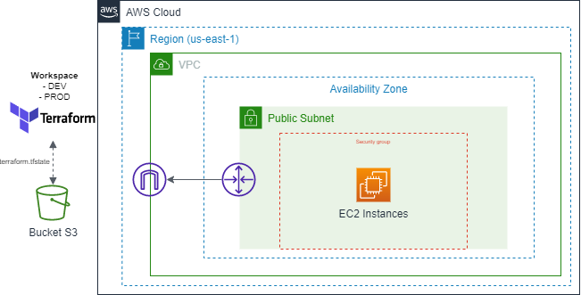

## Laboratório Terraform + AWS

> Este laboratório foi realizado para ministrar a disciplina de Cultura e Práticas DevOps (PucMinas).

Criação da infraestrutura AWS com Terraform. 



Recursos criados:
- VPC
- Internet Gateway
- Subnet
- Security Group
- EC2
- Backend S3 - Armazenar o tfstate

---
Configuração das credenciais AWS

```sh
$ aws configure --profile <profile_name>

AWS Access Key ID [None]: <access_key_id>
AWS Secret Access Key [None]: <secret_access_key>
Default region name [None]: <region_name>
Default output format [None]: <text/json>
```

```sh
$ cat ~/.aws/credentials

[<profile_name>]
aws_access_key_id = <access_key_id>
aws_secret_access_key = <secret_access_key>
```

---

Executar scripts Terraform

```sh
$ cd infrastructure

$ terraform init

$ terraform plan

$ terraform apply
```

---